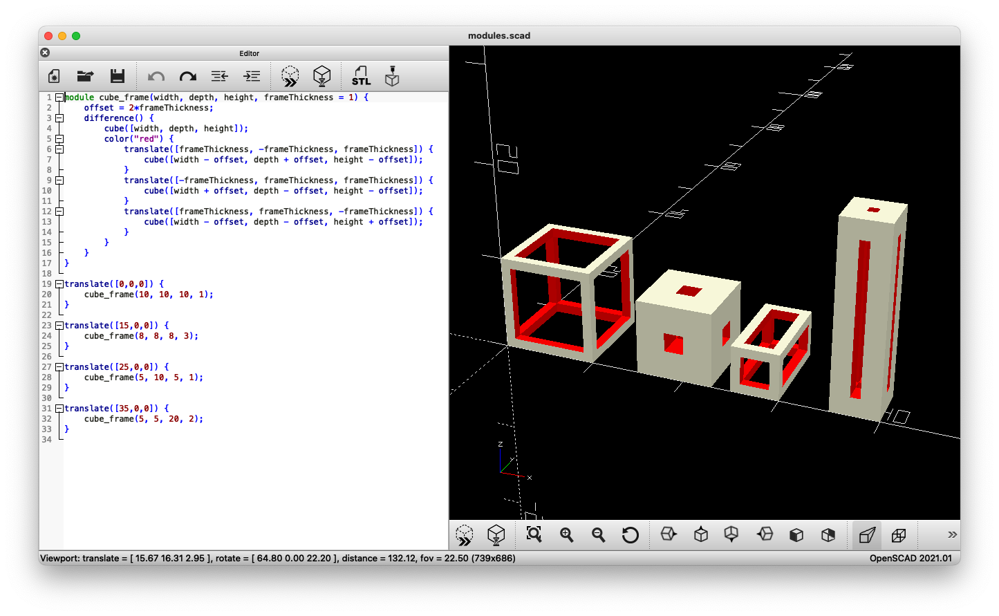
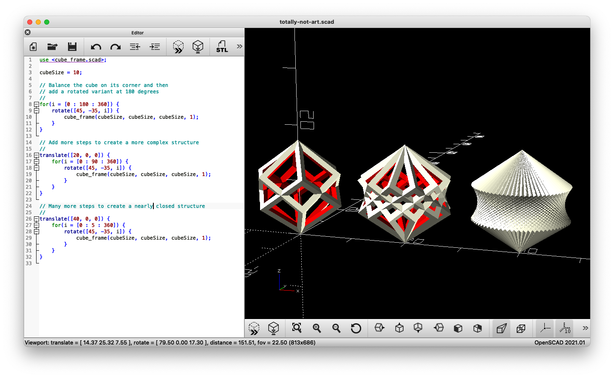

# Programming in 3D


I have a saying "programming is a skill, the language is merely a choice". I also have a hobby: 3D printing. 
Like programming, 3D printing is a creative process where mastery of your tools and craft is part of the fun.
The tools for 3D modeling your own objects are visual sculpting/drawing tools or CAD design software.
Sadly I am not as talented with visual tools as I am with a coding editor, yet I still wanted to create my own 3D models.
And thats when I found [OpenSCAD](https://openscad.org/), "The Programmers Solid 3D CAD Modeller".
So what is it? Well its pretty much coding 3D objects and rendering them. Declarative CAD modelling if you will.
Lets just look at some examples to clarify.

## Solid objects

In OpenSCAD your code describes simple objects like cubes, spheres and cylinders and where to put them in the 3D world.
So to create a cube that is 10x10x10 you would write `cube(10)` or `cube([10,10,10])`.
For a sphere this is 10x10 you would write `sphere(5)`. 
The value here is 5 because spheres work with a radius (r) which is half the diameter (d).
Yup, those math classes are finally starting to pay off.
All objects are placed in the world on a grid of x, y and z. 
The `translate(x,y,z)` method can be used to place your objects where you want it.
Note that spheres and cylinders are placed around their center. 
So to place them in-line with our cube we will need to place them further back on the Y axis.


## Additions and extractions

Basic shapes are good and all but they are kind of boring.
So how do we actually make something? Well by adding and removing pieces using good old boolean operations: union, difference and intersection.
With `union` you simple merge the objects together into one big clump.
One of my most used operations is `difference` to remove the shape of one object from another.
The `intersection` operation is a bit more advanced in that it only keeps the parts where both objects occupy the same space.
Using the difference operation and some cubes sticking through another cube we can create a cube frame.
So lets see what that looks like. I will also be introducing `color` here to help highlight the different pieces.


> I am overextending the subtracted cubes on purpose to create a cleaner render. If you make them exactly the size of the cube dimensions it will work just fine but the OpenSCAD render will show incredibly thin flickering edges. Overextending the shapes fixes this.

## You said there would be programming

So far we might as well have been writing HTML and declaring tags and attributes.
In OpenSCAD we can however also make functions, variables, etc.
The next step is making our cube frame into a module so we can make multiples of them in any size and frame width.
In this example I will place the module inside the same file but you can (and should) put the module into it's own file and then import it using syntax like `use <cube_frame.scad>;`

Okay so lets make the cube frame into a module shall we.

```openscad
module cube_frame(width, depth, height, frameThickness = 1) {
    offset = 2*frameThickness;
    difference() {
        cube([width, depth, height]);
        color("red") {
            translate([frameThickness, -frameThickness, frameThickness]) {
                cube([width - offset, depth + offset, height - offset]);
            }
            translate([-frameThickness, frameThickness, frameThickness]) {
                cube([width + offset, depth - offset, height - offset]);
            }
            translate([frameThickness, frameThickness, -frameThickness]) {
                cube([width - offset, depth - offset, height + offset]);
            }
        }
    }
}
```

Through the `width`, `depth` and `height` parameters we are allowing the caller of the module to determine how big the cube will be.
The `frameThickness` determines how big the remaining edges of the cube will be after the `difference` operations. For each dimension you take the full size of the cube and subtract the frame width twice. Once for each end of the frame. Below are some examples which illustrate how fast we can create some interesting shapes using this fairly simple module.



## Lets have some fun

Okay so we have a generator for cube frames and a 3D programming language with flow control options.
I'm sure we can make some abstract art using a for loop and our new module...



## Wrapping up

So by leveraging my existing programming skills with a lifetime of math traumas I was able to step into the amazing world of 3D modeling without learning visual modeling tools. I've been putting this to good  use (debatable) filling our yearly customer and employee christmas goody bags. Last year we had SpringTree snow globes and I have an every expanding collection of SpringTree trees in various sizes.
There are many more useful functions in OpenSCAD and I couldn't possibly mention them all in this post.
Perhaps something for a future blog update.

I hope you all enjoyed learning about OpenSCAD and if you end up dabbling with it...have fun!


And just to prove it, here is a very quick printed version of the cube frame from the examples


Useful links:

* [OpenSCAD](https://openscad.org/)
* [OpenSCAD cheat sheet](https://openscad.org/cheatsheet/)
* [Sources for this blog post](https://github.com/SpringTree/blog-programming-in-3d)

